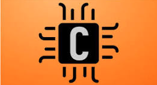
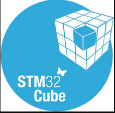
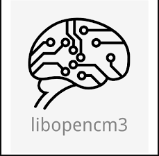
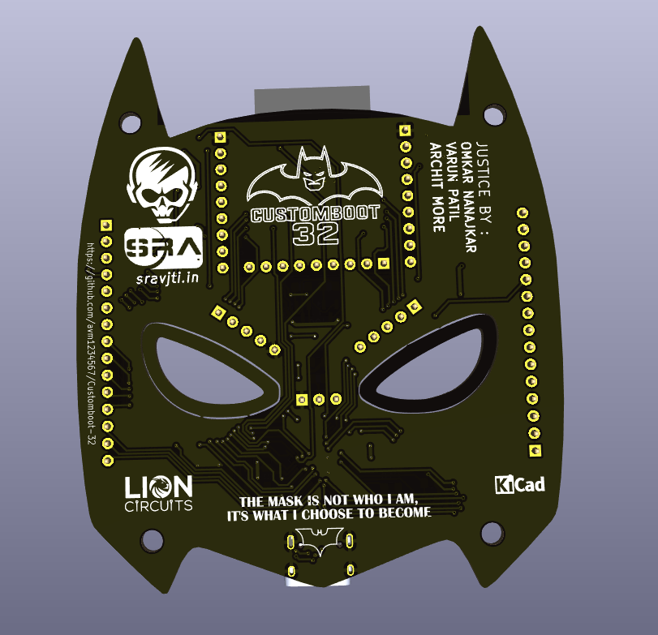

<p>
<h1 align = "center" > <strong>🚀 CustomBoot-32</strong> <br></h1>

<h2 align = "center">

</p>

[SRA](https://www.sravjti.in/) Eklavya 2025 ✨<br></h2>  


<!-- TABLE OF CONTENTS -->
## Table of Contents

* [About the Project](#about-the-project)
  - [Aim](#aim)
  - [Description](#description)
  - [Tech-Stack](#tech-stack)
  - [File Structure](#file-structure)
* [Getting Started](#getting-started)
  <!-- * [Prerequisites](#prerequisites) -->
  * [Installation](#installation)
* [Usage](#usage)
* [Results and Demo](#results-and-demo)
* [Future Work](#future-work)
* [Troubleshooting](#troubleshooting)
* [Contributors](#contributors)
* [Mentors](#mentors)
* [Resources](#resources)
* [Acknowledgement](#acknowledgements)


<!-- ABOUT THE PROJECT -->
# ⭐ About the project
## Aim
Designing a custom PCB with OTA support and dual image Bootloader using ESP32 WROOM-32D and STM32F103C8T6.

## Description
The main aim is creating a custom PCB that integrates Blue Pill(STM32F103C8T6) with ESP32 WROOM-32D, 
which uses OTA feature of ESP to receive two firmwares from a Website hosted
by ESP itself, create memory partitions in ESP and initialize a File System in
one of the partitions. Further on the STM side, we created a Dual-Image Boot-
loader that requests Firmware according to the user input, verifies it, allocates
it in the flash memory and executes it. The firmware transfer is carried out via
UART.

## Tech-Stack
### Coding Language
<div style="display:flex; align-items:center; margin-bottom:8px;">
  
  <span style="background:#ff6f3c; color:white; padding:4px 10px; border-radius:4px; font-weight:bold;">
    Embedded C
  </span>
</div>


### Libraries
<div style="display:flex; align-items:center; margin-bottom:8px;">
  
  <span style="background:#ff6f3c; color:white; padding:4px 10px; border-radius:4px; font-weight:bold;">
    HAL
  </span>
</div>

<div style="display:flex; align-items:center; margin-bottom:8px;">
  
  <span style="background:#ff6f3c; color:white; padding:4px 10px; border-radius:4px; font-weight:bold;">
    LibOpenCM3
  </span>
</div>


### File Protocol
<div style="display:flex; align-items:center; margin-bottom:8px;">
  
  <span style="background:#ff6f3c; color:white; padding:4px 10px; border-radius:4px; font-weight:bold;">
    SPIFFS
  </span>
</div>

### Communication Protocols
<div style="display:flex; align-items:center; margin-bottom:8px;">
  
  <span style="background:#ff6f3c; color:white; padding:4px 10px; border-radius:4px; font-weight:bold;">
    UART
  </span>
</div>
<div style="display:flex; align-items:center; margin-bottom:8px;">
  
  <span style="background:#ff6f3c; color:white; padding:4px 10px; border-radius:4px; font-weight:bold;">
    OTA
  </span>
</div>
<br><br>

<br><br>

## 📁 File structure

    .
    ├── 1. OTA
    │   ├── CMakeLists.txt
    │   ├── main
    │   ├── partitions.csv
    │   ├── README.md
    │   ├── sdkconfig
    │   ├── sdkconfig.old
    │   └── spiffs
    ├── 2. Dual_Image_Bootloader
    │   ├── Learning_Bootloader
    │   ├── LED_BLINK
    │   └── LED_BLINK_2
    ├── 3. ESP_STM_UART1
    │   ├── ESP_STM_COMM
    │   └── UART_Test_3
    ├── 4. ESP_STM_UART2
    │   ├── ESP_STM_COMM
    │   └── UART_Test_3
    ├── 5. ESP_TO_STM_FIRMWARE_VIA_UART
    │   ├── Learning_Bootloader
    │   ├── OTA
    │   └── STM_Bootloader_Mini_LibOpenCM3
    ├── 6. ESP_STM_FILE_CRC
    │   ├── Bootloader_C8TX
    │   ├── Default_App
    │   └── OTA
    ├── 7. Controling_ESP_GPIO_Wirelessly
    │   ├── build
    │   ├── CMakeLists.txt
    │   ├── main
    │   ├── README.md
    │   └── sdkconfig
    └── 8. Wireless_Firmware_Selection_ESP_STM(Additional)
        ├── Bootloader_C8TX
        ├── Default_App
        └── OTA


<br><br>    

<!-- GETTING STARTED -->
## Getting Started

### Installation
1) Clone the repo<br>
`git clone https://github.com/avm1234567/Customboot-32/tree/varun`

2) Navigate to the project directory<br>
`cd CustomBoot-32` 
<br><br>


<!-- USAGE EXAMPLES -->
## Usage
```
All the codes are to be executed using their respective execution environments like ESP-IDF, PlatformIO, STM32 Cube IDE, STM32 CUBE Programmer, etc. Before execution do clean the previous builds for errorless execution.
```


<!-- RESULTS AND DEMO -->
## Results and Demo

**Screenshot of our custom PCB:**



<!-- **Simple dual image Bootloader in folder 2:**
<h3 align = "center">SimpleBootloader.mp4</h3>

**Duplex UART communication between ESP and STM in folder 4:**
<video src="assets/2WayUART.mp4" controls width="720" poster="thumb.jpg" mute align = "center"></video>
<h3 align = "center">Duplex Communication between ESP and STM via UART</h3>


**Test to wirelessly control ESP's GPIOs using buttons in website:**
<video src="assets/Wireless_CMD_Test.mp4" controls width="720" poster="thumb.jpg" mute align = "center"></video>
<h3 align = "center">LED on/off using website wirelessly</h3>
 -->

<h2 align = "center">
Recording of the perfboard testing of STM32F103C8T6 SOC with the codes available in folder number 7:

[**Full Working using STM SOC soldered on the breakout board andtested on perfboard**](https://drive.google.com/file/d/15sZR7zUH3JRWFjR2rwua6hHhE9rVFGUJ/view?usp=drive_link)
</h2>


<!-- FUTURE WORK -->
## Future Work

- Trying to integrate SD card support to handle morre than 2 firmwares.
- Adding LED arrays for better visual appealing.
- Running multiple STM based projects to test our board's capabilities.


<!-- TROUBLESHOOTING -->
## Troubleshooting
* ERC rule check errors in PCB schematics.
* Routing in compact areas while adhering to PCB manufacturer constraints.
* Wi-Fi SSID and password options not appearing in Menuconfig.
* CMakeLists errors affecting SPIFFS initialization.
* Partition table not being detected.
* SPIFFS initialization failure at runtime.
* Favicon loading errors.
* Unnecessary bloatware included with OTA binary files, requiring filtering.
* UART initialization issues.
* Failure in binary file transfer.
* Errors in custom file protocol implementation.
* End-byte transmission errors during communication.
* Application jump not functioning correctly; MSP not set properly.
* Accurate implementation of HAL-like application jump using LibOpenCM3.
* Resolving major schematic issues through perfboard prototyping and testing.


<!-- CONTRIBUTORS -->
## Contributors
* [Varun Patil](https://github.com/varun05050505)
* [Omkar Nanajkar](https://github.com/nomkar24)
* [Archit More](https://github.com/avm1234567)

## Mentors
* [Prithvi Tambewagh](https://github.com/rkt-1597)
* [Shaunak Datar](https://github.com/nomkar24)
* [Vishal Mutha](https://github.com/avm1234567)


## Resources
- [Understanding GIT](https://youtu.be/apGV9Kg7ics?si=QQJMHjStjuuJt9wC)  
- [ESP32 WROOM-32D datasheet](https://www.digikey.in/en/htmldatasheets/production/3267269/0/0/1/esp32-devkitc-32d)  
- [STM32F103C8T6 datasheet](https://www.st.com/resource/en/datasheet/stm32f103c8.pdf)  
- [CP2102 datasheet](https://www.digikey.in/htmldatasheets/production/121410/0/0/1/cp2102-gm.html?gclsrc=aw.ds&gad_source=1&gad_campaignid=146895304&gbraid=0AAAAADrbLlhJZZqjvv2UCZZ3iVlr4LYsd&gclid=Cj0KCQjw5JXFBhCrARIsAL1ckPsLeNYVgjHdsQhaNjdFA3oVTSbDaxx1qRKgEMt8qiXLX2qIpof5GuIaAlVaEALw_wcB)  
- [AMS1117 datasheet](https://mm.digikey.com/Volume0/opasdata/d220001/medias/docus/5011/AMS1117.pdf)  
- [Learning KiCad](https://youtube.com/playlist?list=PLEBQazB0HUyR24ckSZ5u05TZHV9khgA1O&si=0HIawDfIP4Njrpo-)  
- [Designing a full STM blue pill in KiCad](https://youtu.be/aVUqaB0IMh4?si=N4PDonKOkEUr_ZC0)  
- [Bootloader basics (EmbeTronicx)](https://embetronicx.com/tutorials/microcontrollers/stm32/bootloader/bootloader-basics/#goog_rewarded)  
- [Getting Started with bootloader (EmbeddedInventor)](https://embeddedinventor.com/embedded-bootloader-and-booting-process-explained/)  
- [Another blog on bootloader](https://blog.sperka.pl/en/2021/01/lets-make-a-bootloader-for-stm32-pt-1/)  
- [Video on bootloader](https://youtu.be/S0s69xNE1dE?si=PkRS1qKZMWDQEO5x)  
- [Getting started with STM32](https://youtube.com/playlist?list=PLNyfXcjhOAwO5HNTKpZPsqBhelLF2rWQx&si=Qqjizr4BlnJ0h9xE)  
- [Bare-metal UART STM32](https://vivonomicon.com/2020/06/28/bare-metal-stm32-programming-part-10-uart-communication/)  
- [Programming STM32 using USB-to-TTL](https://youtu.be/zUsollWLnV4?si=Ee3k7bhfY8afoKE_)  
- [CRC32 for STM](https://www.st.com/resource/en/application_note/an4187-using-the-stm32-hardware-crc-unit-stmicroelectronics.pdf)  
- [LibOpenCM3 documentation](https://libopencm3.org/docs/latest/stm32f1/html/modules.html)  
- [Git repo to refer LibOpenCM3 implementation](https://github.com/ziteh/stm32-examples)  
- [ESP32 devkit schematic (V4)](https://dl.espressif.com/dl/schematics/esp32_devkitc_v4-sch.pdf)  
- [ESP-IDF programming basics](https://docs.espressif.com/projects/esp-idf/en/stable/esp32/index.html)  
- [ESP32 UART](https://docs.espressif.com/projects/esp-idf/en/stable/esp32/api-reference/peripherals/uart.html)  
- [File systems in ESP32](https://youtu.be/V9-cgXag4Ko?si=5PlxUC6kEpwWESMx)  
- [SPIFFS](https://docs.espressif.com/projects/esp-idf/en/stable/esp32/api-reference/storage/spiffs.html)  
- [FreeRTOS](https://my-esp-idf.readthedocs.io/en/latest/api-guides/freertos-smp.html#tasks-and-task-creation)  
- [Web server handling in ESP](https://esp32tutorials.com/esp32-web-server-esp-idf/)  
- [File transfer protocols](https://www.geeksforgeeks.org/computer-networks/xmodem-file-transfer-protocol/)  
- [C implementation of file protocols at sender's side](https://gist.github.com/zonque/0ae2dc8cedbcdbd9b933)  


<!-- ACKNOWLEDGEMENTS AND REFERENCES -->
## Acknowledgements
We are extremely grateful to our mentors – Prithvi Tambewagh, Shaunak Datar and Vishal Mutha for their guidance and support throughout the course of this project.

We also express gratitude towards [SRA-VJTI](https://sravjti.in/) for their support as well as organization of [’Elkavya - 2025’](https://sravjti.in/projects/eklavya/) and providing us with the opportunity to work on this project.
