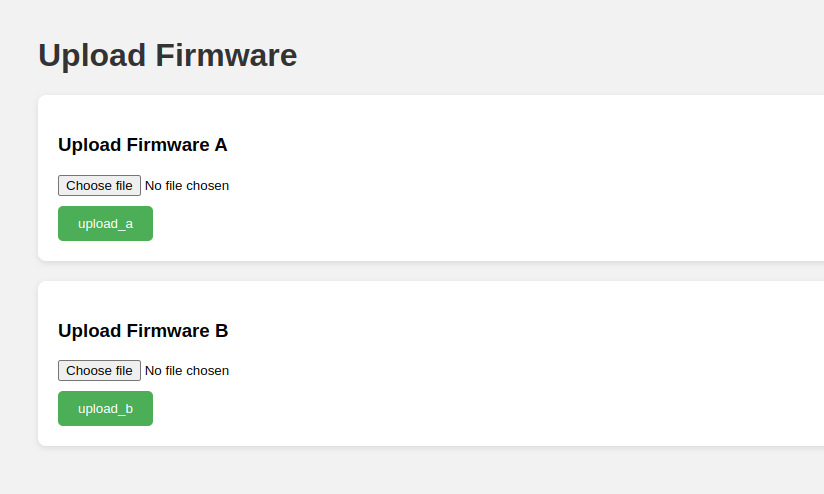
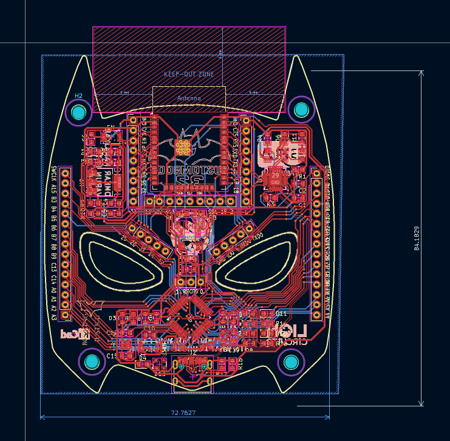
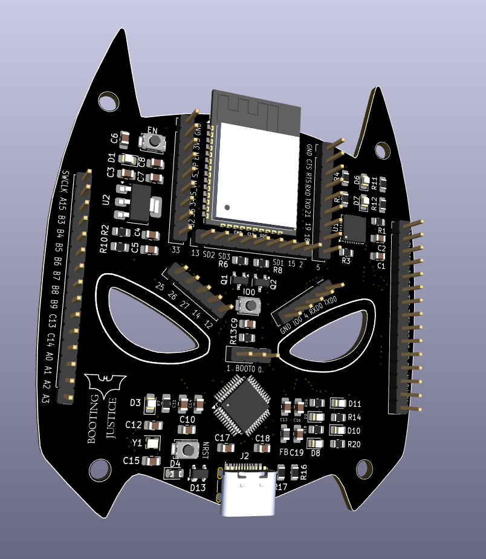

<p>
<h1 align = "center" > <strong>CustomBoot-32</strong> <br></h1>
</p>

# Table of contents

- [About the project](#about-the-project)
    - [Aim](#aim)
    - [Description](#description)
    - [Tech Stack](#tech-stack)
    - [File Structure](#file-structure)
- [Getting Started](#getting-started)
    - [Prerequisites](#prerequisites)
    - [Installation](#installation)
- [Usage](#usage)
- [Results](#results)
- [Contrinutors](#contributors)
- [Acknowledgement](#acknowledgement)

# About the project
## Aim
To design and build a custom, wireless development platform that enables over-the-air firmware uploading and flashing of an STM32 microcontroller using an ESP32 companion module, eliminating the need for physical programming tools.

## Description
The project integrates an STM32F103C8T6 with an ESP32-WROOM-32D to create a self-contained wireless development board. The ESP32 hosts a web server that allows users to upload firmware files, which are then stored in SPIFFS and streamed to the STM32 over UART. The STM32 features a dual-image bootloader capable of validating firmware and rolling back in case of failure. In addition, a simple two-position switch has been incorporated to allow developers to easily switch between normal execution mode and the firmware update mode during testing and development. Overall, the board enables convenient and reliable wireless firmware development, flashing and testing.

## Tech Stack


## File Structure

```

1) Gerber files

2) Schematic files
    ├── 4 SRA.kicad_sch
    └── untitled.kicad_sch

3) assets

```

# Getting Started
## Prerequisites 
- Hardware
    - ESP32 (tested on ESP32-WROOM-32D / ESP32 variant with Wi-Fi support)

    - STM32 microcontroller (tested on STM32F103C8T6)

    - USB-to-TTL adapter (for debugging / initial flashing)
- Software 
    - ESP-IDF

    - STM32CubeIDE 

    - STM32CubeProgrammer

    - KiCad

## Installation
1) Clone the repository<br>
```
git clone https://github.com/avm1234567/Customboot-32.git
```

2) Get in the cloned directory<br>
```
cd Customboot-32
```

# Usage


# Results
## ESP File Sending 


## Routing 


## 3D-View
Front


Back


# Contributors
- Varun Patil

- Omkar Nanajkar

- Archit More

# Acknowledgement
- Shaunak Datar

- Prithvi Tambewagh


