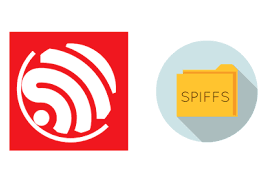

# 🚀 CustomBoot-32

## ✨ SRA Eklavya 2025

---

## 📑 Table of Contents
* [About the Project](#-about-the-project)  
  - [Aim](#aim)  
  - [Description](#description)  
  - [Tech-Stack](#tech-stack)  
  - [File Structure](#file-structure)  
* [Getting Started](#getting-started)  
  * [Installation](#installation)  
* [Usage](#usage)  
* [Results and Demo](#results-and-demo)  
* [Future Work](#future-work)  
* [Report](#report)
* [Troubleshooting](#troubleshooting)  
* [Contributors](#contributors)  
* [Mentors](#mentors)  
* [Resources](#resources)  
* [Acknowledgements](#acknowledgements)  

---

# ⭐ About the Project

## Aim
Designing a custom PCB with OTA support and a dual-image Bootloader using ESP32 WROOM-32D and STM32F103C8T6.

## Description
The project focuses on creating a custom PCB that integrates the Blue Pill (STM32F103C8T6) with ESP32 WROOM-32D.  
The ESP32 hosts a website, receives two firmwares via OTA, creates memory partitions, and initializes a File System in one of the partitions.  

On the STM side, a dual-image Bootloader requests firmware based on user input, verifies it, allocates it in flash memory, and executes it.  
The firmware transfer is carried out via **UART**.

## Tech-Stack
### Coding Language
<div style="display:flex; align-items:center; margin-bottom:8px;">
  
  <span style="background:#ff6f3c; color:white; padding:4px 10px; border-radius:4px; font-weight:bold;">
    Embedded C
  </span>
</div>


### Libraries
<div style="display:flex; align-items:center; margin-bottom:8px;">
  
  <span style="background:#ff6f3c; color:white; padding:4px 10px; border-radius:4px; font-weight:bold;">
    HAL
  </span>
</div>

<div style="display:flex; align-items:center; margin-bottom:8px;">
  
  <span style="background:#ff6f3c; color:white; padding:4px 10px; border-radius:4px; font-weight:bold;">
    LibOpenCM3
  </span>
</div>


### File Protocol
<div style="display:flex; align-items:center; margin-bottom:8px;">
  
  <span style="background:#ff6f3c; color:white; padding:4px 10px; border-radius:4px; font-weight:bold;">
    SPIFFS
  </span>
</div>

### Communication Protocols
<div style="display:flex; align-items:center; margin-bottom:8px;">
  
  <span style="background:#ff6f3c; color:white; padding:4px 10px; border-radius:4px; font-weight:bold;">
    UART
  </span>
</div>
<div style="display:flex; align-items:center; margin-bottom:8px;">
  
  <span style="background:#ff6f3c; color:white; padding:4px 10px; border-radius:4px; font-weight:bold;">
    OTA
  </span>
</div>
<br><br>

<br><br>

## 📁 File Structure

```
CustomBoot-32
├── 1. OTA
│   ├── CMakeLists.txt
│   ├── main
│   ├── partitions.csv
│   ├── README.md
│   ├── sdkconfig
│   ├── sdkconfig.old
│   └── spiffs
├── 2. Dual_Image_Bootloader
│   ├── Learning_Bootloader
│   ├── LED_BLINK
│   └── LED_BLINK_2
├── 3. ESP_STM_UART1
│   ├── ESP_STM_COMM
│   └── UART_Test_3
├── 4. ESP_STM_UART2
│   ├── ESP_STM_COMM
│   └── UART_Test_3
├── 5. ESP_TO_STM_FIRMWARE_VIA_UART
│   ├── Learning_Bootloader
│   ├── OTA
│   └── STM_Bootloader_Mini_LibOpenCM3
├── 6. ESP_STM_FILE_CRC
│   ├── Bootloader_C8TX
│   ├── Default_App
│   └── OTA
├── 7. Controlling_ESP_GPIO_Wirelessly
│   ├── build
│   ├── CMakeLists.txt
│   ├── main
│   ├── README.md
│   └── sdkconfig
└── 8. Wireless_Firmware_Selection_ESP_STM (Additional)
    ├── Bootloader_C8TX
    ├── Default_App
    └── OTA
```

---

## 🚀 Getting Started

### Installation
1. Clone the repo  
   ```bash
   git clone https://github.com/avm1234567/Customboot-32.git
   ```
2. Navigate to the project directory  
   ```bash
   cd CustomBoot-32
   ```

---

## ⚡ Usage
    All the codes are to be executed using their respective execution environments like **ESP-IDF, PlatformIO, STM32 CubeIDE, STM32 CUBE Programmer, etc.**  
    Before execution, clean the previous builds for error-free compilation.

---

## 📸 Results

**Screenshot of our custom PCB:**  

  
<br>
  
<br>


## Demo:  
[Working Demo of final PCB)](https://drive.google.com/file/d/1Z0VfDI0KjEA28zM6vQ-hMSaG2jekwzWR/view?usp=drive_link)  

For other results and test videos, please check our [Google Drive](https://drive.google.com/drive/folders/1JogM4m4yME66ZIJGMlyX8mcmxp7ndMSk?usp=drive_link).

## Report
Refer our own [report](https://drive.google.com/file/d/13CS2zIfVXfLGR-wP4OjCv9lpuOwN3wu8/view?usp=drive_link) of project where we explain the entire process in detail.

## 🛠 Troubleshooting
* ERC rule check errors in PCB schematics.  
* Routing issues in compact areas while adhering to manufacturer constraints.  
* Wi-Fi SSID and password options not appearing in Menuconfig.  
* CMakeLists errors affecting SPIFFS initialization.  
* Partition table not being detected.  
* SPIFFS initialization failure at runtime.  
* Favicon loading errors.  
* OTA binaries containing unnecessary bloatware.  
* UART initialization issues.  
* Binary file transfer failures.  
* Errors in custom file protocol implementation.  
* End-byte transmission errors during communication.  
* Application jump not functioning correctly (MSP not set).  
* Correct HAL-like application jump with LibOpenCM3.  
* Schematic issues resolved through perfboard prototyping and testing.  

---

## 👥 Contributors
* [Varun Patil](https://github.com/varun05050505)  
* [Omkar Nanajkar](https://github.com/nomkar24)  
* [Archit More](https://github.com/avm1234567)  

## 🎓 Mentors
* [Prithvi Tambewagh](https://github.com/rkt-1597)  
* [Shaunak Datar](https://github.com/nomkar24)  
* [Vishal Mutha](https://github.com/avm1234567)  

---

## 📚 Resources
- [Understanding GIT](https://youtu.be/apGV9Kg7ics?si=QQJMHjStjuuJt9wC)  
- [ESP32 WROOM-32D datasheet](https://www.digikey.in/en/htmldatasheets/production/3267269/0/0/1/esp32-devkitc-32d)  
- [STM32F103C8T6 datasheet](https://www.st.com/resource/en/datasheet/stm32f103c8.pdf)  
- [CP2102 datasheet](https://www.digikey.in/htmldatasheets/production/121410/0/0/1/cp2102-gm.html)  
- [AMS1117 datasheet](https://mm.digikey.com/Volume0/opasdata/d220001/medias/docus/5011/AMS1117.pdf)  
- [Learning KiCad](https://youtube.com/playlist?list=PLEBQazB0HUyR24ckSZ5u05TZHV9khgA1O)  
- [Designing STM Blue Pill in KiCad](https://youtu.be/aVUqaB0IMh4)  
- [Bootloader basics (EmbeTronicx)](https://embetronicx.com/tutorials/microcontrollers/stm32/bootloader/bootloader-basics/)  
- [EmbeddedInventor: Bootloader](https://embeddedinventor.com/embedded-bootloader-and-booting-process-explained/)  
- [Blog: Bootloader for STM32](https://blog.sperka.pl/en/2021/01/lets-make-a-bootloader-for-stm32-pt-1/)  
- [Video: Bootloader STM32](https://youtu.be/S0s69xNE1dE)  
- [Getting Started with STM32](https://youtube.com/playlist?list=PLNyfXcjhOAwO5HNTKpZPsqBhelLF2rWQx)  
- [Bare-metal UART STM32](https://vivonomicon.com/2020/06/28/bare-metal-stm32-programming-part-10-uart-communication/)  
- [Programming STM32 via USB-TTL](https://youtu.be/zUsollWLnV4)  
- [CRC32 for STM](https://www.st.com/resource/en/application_note/an4187-using-the-stm32-hardware-crc-unit-stmicroelectronics.pdf)  
- [LibOpenCM3 documentation](https://libopencm3.org/docs/latest/stm32f1/html/modules.html)  
- [LibOpenCM3 Examples](https://github.com/ziteh/stm32-examples)  
- [ESP32 DevkitC V4 schematic](https://dl.espressif.com/dl/schematics/esp32_devkitc_v4-sch.pdf)  
- [ESP-IDF Programming Basics](https://docs.espressif.com/projects/esp-idf/en/stable/esp32/index.html)  
- [ESP32 UART](https://docs.espressif.com/projects/esp-idf/en/stable/esp32/api-reference/peripherals/uart.html)  
- [File systems in ESP32](https://youtu.be/V9-cgXag4Ko)  
- [SPIFFS](https://docs.espressif.com/projects/esp-idf/en/stable/esp32/api-reference/storage/spiffs.html)  
- [FreeRTOS](https://my-esp-idf.readthedocs.io/en/latest/api-guides/freertos-smp.html#tasks-and-task-creation)  
- [ESP Web Server Handling](https://esp32tutorials.com/esp32-web-server-esp-idf/)  
- [File Transfer Protocols](https://www.geeksforgeeks.org/computer-networks/xmodem-file-transfer-protocol/)  
- [C implementation of file protocols (Sender side)](https://gist.github.com/zonque/0ae2dc8cedbcdbd9b933)  

---

## 🙏 Acknowledgements
We are extremely grateful to our mentors – **Prithvi Tambewagh, Shaunak Datar, and Vishal Mutha** – for their guidance and support throughout the course of this project.  

We also thank [SRA-VJTI](https://sravjti.in/) for their support in organizing [Eklavya 2025](https://sravjti.in/projects/eklavya/) and for providing us the opportunity to work on this project.  